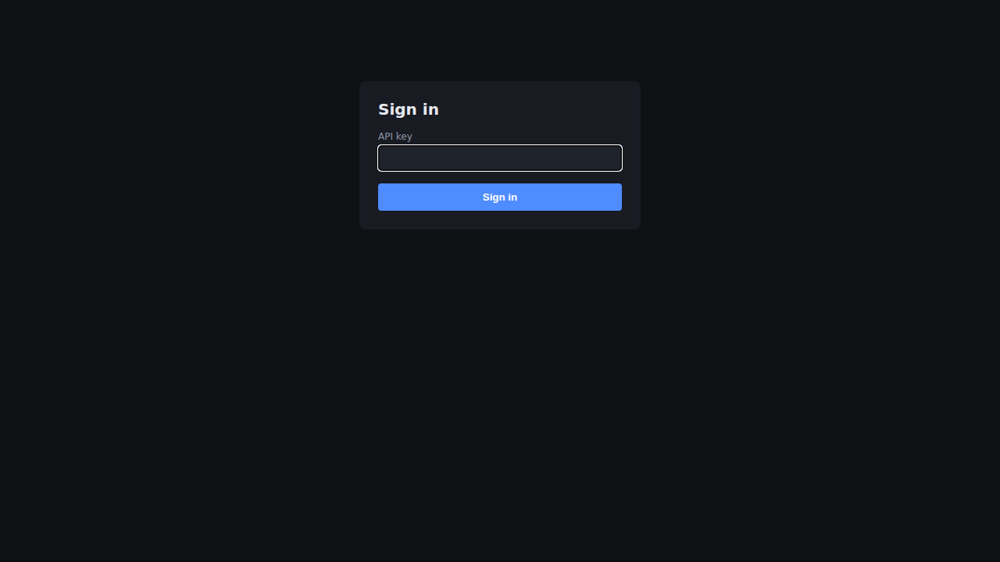
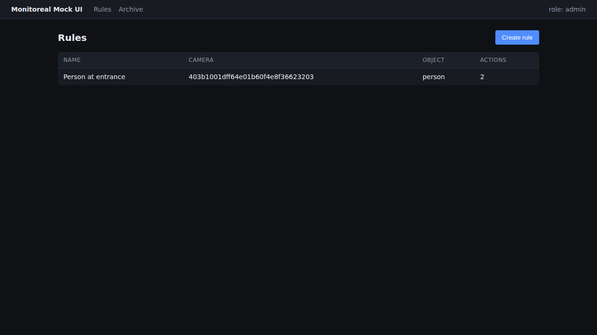
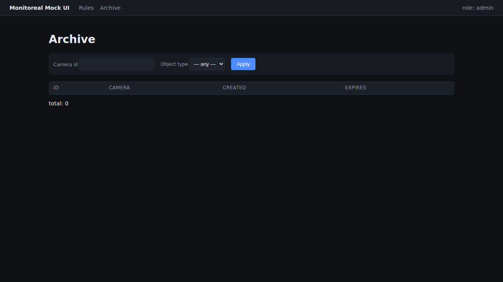

# Monitoreal AQA Showcase

Небольшой AQA-фреймворк под домен Edge AI video surveillance. Mock-сервер на FastAPI, четыре слоя тестов, GitHub Actions, Allure на Pages. Один `make up` — и всё поднимается.


**Live-отчёт Allure:** https://damienadv.github.io/monitoreal-aqa-show-case/

---

## Disclaimer

Репозиторий не входит в продакшен monitoreal.com. Реальных данных я не использовал — всё внутри придумано и собрано с нуля. Я показываю, как подошёл бы к тестированию платформы такого класса.

---

## Зачем это

Откликаюсь на вакансию AQA в Monitoreal. Вместо того чтобы ждать «тестовое», собрал свой пример того, как подошёл бы к задаче.

Что хотел показать:

- ставлю тестирование с нуля — стратегия, риски, контракты, а не просто «накидал автотестов»;
- API / contract / UI / e2e на Python (pytest, Playwright, Schemathesis);
- внятный CI (GitHub Actions) и воспроизводимое окружение (Docker Compose + Makefile);
- изучил release notes — главный e2e-сценарий построен вокруг свежей фичи из v2.4.1 от 22.05.2026.

---

## Что моделирую

Кусочек платформы Monitoreal-типа:

- камеры (`cam-01`, `cam-02`) шлют в API события детекции;
- сервис прогоняет их через правила — `object_type`, ROI, расписание, threshold;
- одно правило может запускать сразу **несколько действий** — `relay`, `audio`, `mobile_push`, `webhook` — последовательно или параллельно;
- всё попадает в архив со снапшотом и метаданными;
- retention периодически чистит просроченное.

Контракт API — [`docs/api_contract.yaml`](docs/api_contract.yaml) (OpenAPI 3.1).

---

## Слои тестирования

| Слой | Папка | Раннер | Тестов | Что проверяет |
|---|---|---|---:|---|
| API regression | `tests/api/` | pytest + httpx | 13 | бизнес-логика, валидация, auth, идемпотентность, retention |
| Contract | `tests/contract/` | Schemathesis + jsonschema | 13 | соответствие реализации OpenAPI-контракту |
| UI smoke | `tests/ui/` | Playwright (sync) | 4 | login, создание правила, фильтр архива |
| E2E | `tests/e2e/` | pytest | 1 | ⭐ «detection → правило с 4 actions sequentially → архив» |

Итого 35 тестов в CI. Каждый в docstring ссылается на конкретный риск из [`docs/risk_matrix.md`](docs/risk_matrix.md), так связка «риск ↔ покрытие» остаётся прозрачной при первом же взгляде.

---

## Как запустить

Нужен только Docker.

```bash
git clone https://github.com/Damienadv/monitoreal-aqa-show-case
cd monitoreal-aqa-show-case
cp .env.example .env

make up           # mock-api в Docker
make test-all     # все 4 слоя
make report       # локальный Allure
make down
```

От свежего `git clone` до зелёных тестов — **≤ 5 минут**.

Полный список `make`-целей:

```
make up           # docker compose up -d
make down         # docker compose down -v
make logs         # tail mock-api logs
make lint         # ruff + mypy
make test-api
make test-contract
make test-ui
make test-e2e
make test-all     # всё + lint
make report       # allure serve
```

---

## Стек

| Категория | Инструмент |
|---|---|
| Язык | Python 3.12 |
| API | FastAPI 0.115 + Uvicorn + Pydantic v2 |
| БД | SQLite (SQLAlchemy 2.x + aiosqlite) |
| Test runner | pytest 8 + pytest-asyncio |
| HTTP | httpx (ASGITransport, без сети) |
| Contract | Schemathesis 3 + jsonschema |
| UI | Playwright (Python) 1.48 |
| Lint | Ruff + mypy strict + pre-commit |
| Containers | Docker + Compose v2 |
| CI | GitHub Actions |
| Reports | Allure + pytest-html |
| Package manager | uv |

---

## Структура

```
monitoreal-aqa-show-case/
├── docs/
│   ├── test_strategy.md          # как тестируем — 10 секций
│   ├── risk_matrix.md            # риски продукта с тест-покрытием
│   ├── bug_report_examples.md    # 3 примера баг-репортов
│   └── api_contract.yaml         # OpenAPI 3.1
├── src/mock_server/              # FastAPI app
├── tests/
│   ├── api/ contract/ ui/ e2e/
│   ├── conftest.py
│   └── factories.py
├── .github/workflows/ci.yml
├── docker-compose.yml
├── Dockerfile
├── Makefile
├── pyproject.toml
└── README.md
```


---

## Скриншоты

| Demo UI — Login | Demo UI — Rules | Demo UI — Archive |
|---|---|---|
|  |  |  |

Allure trends-скриншот появится здесь после первого зелёного прогона CI и публикации на Pages.

---

## Главный сценарий — Multiple Actions per Rule

Файл: [`tests/e2e/test_multiple_actions_per_rule.py`](tests/e2e/test_multiple_actions_per_rule.py)

```gherkin
Given camera cam-01 is active
And   rule "E2E flagship: 4 sequential actions" exists, action_mode=sequential,
      actions = [relay (0), audio (1), mobile_push (2), webhook (3)]
When  detection event arrives (object_type=person, confidence=0.92)
Then  POST /api/v1/detections returns 201
And   matched_rule_ids contains the rule, alert_event_ids has length 1
And   AlertEvent.actions_executed has 4 entries with status='done'
And   types are exactly [relay, audio, mobile_push, webhook] (sequential order)
And   ArchiveItem linked to AlertEvent is created
And   GET /api/v1/archive returns the new item
```

Сценарий не случайный. В Monitoreal v2.4.1 (22.05.2026) появилась фича Multiple Actions per Rule — этот тест её покрывает.

---

## Что добавил бы при доступе к реальной системе

Список вещей, которых нет в проекте по этическим или техническим причинам, но которые я бы делал внутри команды:

- настоящие RTSP/IP camera-интеграции — потери пакетов, таймауты, reconnect, битые потоки;
- mobile push-уведомления (Appium + iOS/Android-эмуляторы);
- Telegram-нотификации end-to-end;
- обновление прошивки appliance и миграции;
- деградация сети — `tc` или toxiproxy;
- failover/restart appliance и сохранение state;
- Prometheus + Grafana ;
- mobile UI на их официальном приложении;
- **нагрузочное тестирование** (Locust / k6) — здесь намеренно не делал, чтобы не размывать scope портфолио; внутри команды поставил бы baseline + SLA-gates в CI;


---

## Контакты

Дмитрий Андропов · [Telegram @dima_an](https://t.me/dima_an) · [LinkedIn](https://www.linkedin.com/in/dmitriy-andropov-a2711183/)

---

## License

MIT — см. [LICENSE](LICENSE).

Репозиторий — портфолио. Код и документация — можно брать как образец.
